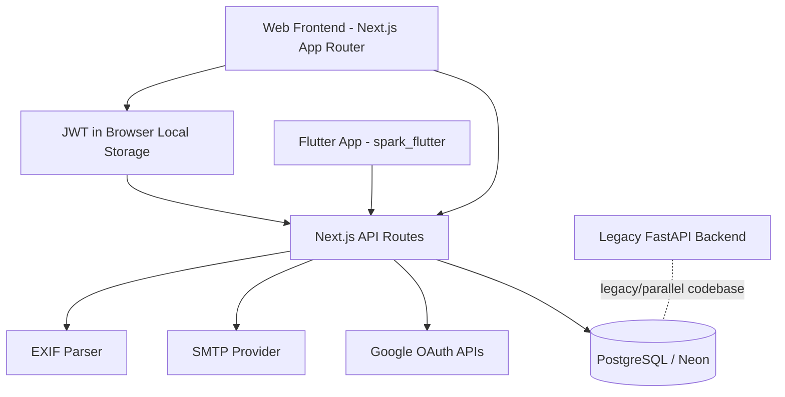

# SPARK - Detailed Project Description and Architecture

## 1. Project Overview

The project is a role-based student activity platform focused on event participation, proof submission, and points tracking.

It supports two primary user types:
- Students: discover events, submit participation proof, track status and points.
- Admins: create events, manage event capacities, review submissions, and award points.

A key feature is photo-based verification using metadata (EXIF + geolocation/time checks), allowing automatic approval for valid submissions and manual review for edge cases.

## 2. Product Goals

- Digitize student activity tracking under the SPARK points framework.
- Reduce manual verification workload through automated checks.
- Provide transparent status updates and notifications to students.
- Support location-based and time-bound event validation.
- Keep workflows role-aware (student vs admin).

## 3. High-Level System Architecture

### Architecture style
- Monorepo with multiple app surfaces.
- Primary production implementation is full-stack Next.js (frontend + backend API routes).
- PostgreSQL is the single source of truth for auth profiles, events, submissions, and points.
- Auxiliary codebases exist for legacy backend and mobile clients.

## 4. Main Application Surfaces

### 4.1 Active Web App (Primary)
- Path: `src/`
- Framework: Next.js (App Router), React, TypeScript, Tailwind CSS.
- Backend logic is implemented as Next.js Route Handlers under `src/app/api`.

### 4.2 Legacy Backend (Secondary/Legacy)
- Path: `python_app_legacy/`
- Framework: FastAPI.
- Contains earlier activity/request/submission flows.
- Appears retained for reference or migration fallback; current feature work is concentrated in Next.js routes.

### 4.3 Mobile Client (In Progress)
- Path: `spark_flutter/`
- Framework: Flutter with Riverpod and GoRouter.
- Includes modern mobile dependencies (camera, geolocation, map, charts).
- Can integrate with existing Next.js APIs.

## 5. Core Domain Modules

## 5.1 Authentication and Authorization

### Auth model
- JWT bearer tokens are issued by backend routes.
- Token payload contains `user_id` and `role` (`student` or `admin`).
- Protected APIs use shared authorization checks via `requireAuth`.

### Login paths
- Admin email/password login route.
- Student Google OAuth flow with domain restriction (`@sahyadri.edu.in`).
- Registration completion route for first-time Google users.

### Session handling
- Client stores token in localStorage and hydrates session state in context provider.
- Profile fetch endpoint depends on role (`/api/students/me` or `/api/admins/me`).

## 5.2 Event Management

### Admin-created events
- Admin creates events with:
  - category
  - points
  - location (lat/lng + location name)
  - location radius in meters
  - start/end window
  - time tolerance
  - optional capacity

### Student personal events
- Students can create personal events (marked `is_personal = true`, `personal_owner_id = student`).
- These are isolated from global event listings for other users.

### Event list behavior
- APIs compute runtime flags:
  - `is_ongoing`
  - `is_upcoming`
  - `is_past`
  - participation metrics

## 5.3 Submission and Verification Pipeline

### Verification path
1. Student uploads photo via multipart form to photo verification API.
2. Service extracts EXIF metadata (GPS + timestamp + camera info).
3. Fallbacks can use browser-provided location/time when EXIF data is missing.
4. Verification checks:
   - Location: Haversine distance <= event radius.
   - Time: within event window plus tolerance.
5. Outcome:
   - Auto-verified if all checks pass.
   - Pending manual review otherwise.

### Review workflow
- Admin fetches pending submissions.
- Admin approves/rejects with optional notes and optional point override.
- Student points are updated accordingly.

## 5.4 Notifications and Communication

- Notification records are created for:
  - event creation broadcasts
  - submission accepted/reviewed/rejected updates
  - admin review queue awareness
- Email utility exists via SMTP (`nodemailer`) for asynchronous messaging.

## 6. Data Layer Architecture

### Database
- PostgreSQL accessed via `pg` connection pool.
- Connection configured through environment variable `DATABASE_URL`.
- SSL enabled for hosted DB compatibility.

### Principal tables
- `admins`
- `students`
- `activities` (legacy flow)
- `activity_requests` (legacy flow)
- `submissions` (legacy flow)
- `events`
- `event_submissions`
- `notifications`

### Important constraints and indexes
- One submission per student per event: `UNIQUE(student_id, event_id)`.
- Indexes on event status/time/location and submission status/student/event for query speed.

### Migrations
- SQL migrations in `database/` evolve schema incrementally.
- JS runner script executes migration SQL with environment-aware DB connection handling.

## 7. API Architecture

### Structure
- Route handlers under `src/app/api/**/route.ts`.
- Endpoints grouped by domain:
  - `auth/*`
  - `events/*`
  - `event-submissions/*`
  - `photo-verification`
  - `admin/event-submissions`
  - `notifications`

### API design characteristics
- Mostly REST-style JSON routes.
- Bearer token auth over `Authorization` header.
- Role checks at route boundary.
- Request validation done inline in route handlers.

## 8. Frontend Architecture

### App shell
- App Router with shared `layout.tsx` and provider wiring.
- Global auth context for user/token/profile state.

### UI composition
- Student and admin dashboards use reusable components.
- Admin tools include event creation modal, review modal, and capacity editor.
- Mapping UI supports interactive location picking and radius control.

### Styling system
- Tailwind CSS-based utility styling.
- Mix of light/dark support and custom visual sections.
- Material icon fonts and animated UI elements are integrated.

## 9. Technology Stack

## 9.1 Web and Backend Runtime
- Next.js 16 (App Router + Route Handlers)
- React 19
- TypeScript 5
- Node.js runtime (for server routes)

## 9.2 UI and UX
- Tailwind CSS 3
- Framer Motion
- react-icons
- Google Material Icons (web font)

## 9.3 Maps and Geo
- maplibre-gl
- react-map-gl
- Haversine distance computation implemented in project code

## 9.4 Data and Persistence
- PostgreSQL
- pg (node-postgres)
- Neon-compatible connection model

## 9.5 Auth and Security
- jsonwebtoken (JWT creation/verification)
- Google OAuth 2.0 (web + mobile-friendly callback behavior)
- Role-based access checks in API layer

## 9.6 File/Metadata Processing
- exifr for EXIF metadata extraction from uploaded images

## 9.7 Messaging
- nodemailer for SMTP email dispatch

## 9.8 Tooling and Quality
- ESLint 9 + eslint-config-next
- PostCSS
- Type definitions for Node/React/PG/JWT/Nodemailer

## 9.9 Legacy / Parallel Stacks
- Python FastAPI stack in `python_app_legacy`
  - fastapi
  - uvicorn
  - psycopg
  - authlib and related deps
- Flutter stack in `spark_flutter`
  - Riverpod, GoRouter, Dio, camera/geolocator/flutter_map, and more

## 10. Typical Request Flows

## 10.1 Student submission flow
1. Student authenticates and receives JWT.
2. Student fetches events.
3. Student submits photo for an event.
4. Backend verifies metadata and sets status.
5. Points and notification state are updated.

## 10.2 Admin review flow
1. Admin authenticates.
2. Admin retrieves pending submission queue.
3. Admin approves/rejects with optional notes/points override.
4. Student totals and notifications are updated.

## 10.3 Event publishing flow
1. Admin creates event with geo/time constraints.
2. Event persists in DB.
3. Students receive event notification records.

## 11. Current Strengths

- Full-stack TypeScript web implementation with clear domain APIs.
- Practical automated verification logic (location + time).
- Role-aware user experiences and workflows.
- Extensible schema with migration scripts.
- Mobile client foundation already prepared.

## 12. Notable Risks / Improvement Areas

- `next.config.mjs` currently ignores TypeScript build errors, which can hide runtime bugs.
- Admin password route currently compares plaintext DB passwords; should migrate to secure hashing.
- Some README/docs content is template or stale relative to current feature set.
- Legacy and active backends coexist; ownership and deprecation strategy should be explicitly documented.

## 13. Recommended Next Documentation Additions

- Environment variable matrix (`.env` contract) for web/mobile/local/prod.
- ER diagram for events/submissions/notifications.
- Sequence diagram per workflow (OAuth, submit, review).
- Deployment runbook (Neon setup, migration order, smoke tests).
- Security hardening checklist (password hashing, token expiry strategy, upload limits).
